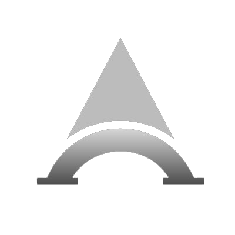

<p align="center">
  
</p>

<p align="center">
  
  
  
</p>

# AzureAI - Solana Code Verification System

AzureAI is a comprehensive system designed to verify and analyze Solana blockchain code, including Solana smart contracts (Rust), Solana Web3.js client code, and TypeScript code. The system provides automated code verification through a microservices architecture.

## System Architecture

AzureAI consists of three main microservices:

1. **MCP Service (SSE Server)** - Provides Server-Sent Events (SSE) interface for code verification requests
2. **Agent Service (API Server)** - Handles code verification logic using LLM integration
3. **RAG Service (Knowledge Base)** - Provides relevant information for code verification

## Features

- Verification of Solana smart contracts (Rust)
- Verification of Solana Web3.js client code
- Verification of TypeScript code
- Integration with multiple LLM providers (OpenAI, Azure OpenAI, Anthropic, Google Gemini)
- RAG (Retrieval-Augmented Generation) for enhanced code analysis
- Containerized deployment with Docker

## Prerequisites

- Docker and Docker Compose
- API keys for at least one LLM provider (OpenAI, Azure OpenAI, Anthropic, or Google Gemini)
- Optional: RAG API key for knowledge base access

## Environment Variables

Create a `.env` file in the project root with the following variables:

```
# Required: At least one of these LLM API keys
OPENAI_API_KEY=your_openai_api_key
AZURE_OPENAI_API_KEY=your_azure_openai_api_key
AZURE_OPENAI_ENDPOINT=your_azure_openai_endpoint
GOOGLE_API_KEY=your_google_api_key

# RAG Service
RAG_API_KEY=your_rag_api_key
```

## Deployment Guide

### Option 1: Docker Compose (Recommended)

1. Clone the repository:
   ```bash
   git clone https://github.com/yourusername/azureai.git
   cd azureai
   ```

2. Create the `.env` file with your API keys as described above.

3. Build and start the services:
   ```bash
   docker-compose up -d
   ```

4. The services will be available at:
   - MCP Service: http://localhost:8080
   - Agent Service: http://localhost:8000
   - RAG Service: http://localhost:8001

### Option 2: Manual Deployment

#### 1. MCP Service

```bash
# Navigate to the project root
cd /path/to/azureai

# Create and activate a virtual environment
python -m venv .venv
source .venv/bin/activate  # On Windows: .venv\Scripts\activate

# Install dependencies
pip install -r mcp/requirements.txt

# Set environment variables
export DEBUG=1
export AGENT_SERVICE_URL=http://localhost:8000

# Start the MCP service
python -m mcp.server
```

#### 2. Agent Service

```bash
# Navigate to the project root
cd /path/to/azureai

# Create and activate a virtual environment (if not already done)
python -m venv .venv
source .venv/bin/activate  # On Windows: .venv\Scripts\activate

# Install dependencies
pip install -r agent/requirements.txt

# Set environment variables
export DEBUG=1
export RAG_SERVICE_URL=http://localhost:8001
export RAG_API_KEY=your_rag_api_key
export OPENAI_API_KEY=your_openai_api_key
# Add other LLM API keys as needed

# Start the Agent service
cd agent
uvicorn app.main:app --host 0.0.0.0 --port 8000
```

#### 3. RAG Service

```bash
# Navigate to the project root
cd /path/to/azureai

# Create and activate a virtual environment (if not already done)
python -m venv .venv
source .venv/bin/activate  # On Windows: .venv\Scripts\activate

# Install dependencies
pip install -r rag/requirements.txt

# Set environment variables
export DEBUG=1
export API_KEY=your_rag_api_key
export OPENAI_API_KEY=your_openai_api_key
# Add other LLM API keys as needed

# Start the RAG service
cd rag
uvicorn app.main:app --host 0.0.0.0 --port 8001
```

## API Usage

### Verify Solana Smart Contract (Rust)

```bash
curl -X POST http://localhost:8000/api/v1/verify/solana-program \
  -H "Content-Type: application/json" \
  -d '{"code": "your Solana contract code here"}'
```

### Verify Solana Web3.js Client Code

```bash
curl -X POST http://localhost:8000/api/v1/verify/solana-code \
  -H "Content-Type: application/json" \
  -d '{"code": "your Solana Web3.js code here"}'
```

### Verify TypeScript Code

```bash
curl -X POST http://localhost:8000/api/v1/verify/typescript \
  -H "Content-Type: application/json" \
  -d '{"code": "your TypeScript code here"}'
```

## Using the MCP SSE Interface

The MCP service provides a Server-Sent Events (SSE) interface for code verification:

```javascript
// Example JavaScript client
const eventSource = new EventSource('http://localhost:8080/sse');

eventSource.onmessage = (event) => {
  const data = JSON.parse(event.data);
  console.log('Received:', data);
};

// Send a verification request
fetch('http://localhost:8080/messages/', {
  method: 'POST',
  headers: {
    'Content-Type': 'application/json',
  },
  body: JSON.stringify({
    jsonrpc: '2.0',
    method: 'analyze_code',
    params: {
      code: 'your code here',
      code_type: 'solana' // or 'web3' or 'typescript'
    },
    id: 1
  })
});
```

## Troubleshooting

- **Connection Issues**: Ensure all services are running and can communicate with each other
- **API Key Errors**: Verify that your API keys are correctly set in the environment variables
- **Container Errors**: Check Docker logs with `docker-compose logs`

## License

[MIT License](LICENSE)
